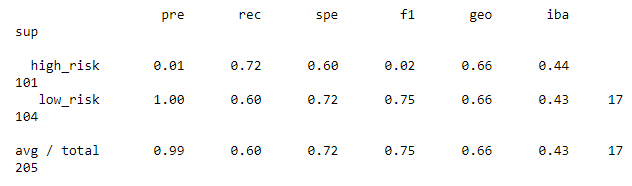

# Credit Risk Analysis
## Overview of the Analysis
Six different models were fit to real world data in order to determine which one best predicts credit risk.  Credit risk is an inherently unbalanced classification problem because good loans easily outnumber risky loans. Different techniques of machine learning were employed to train and evaluate models with unbalanced classes.   

The credit dataset used in the modeling originated from LendingClub, a peer-to-peer lending services company.  Python programming with the help of the imbalanced-learn and scikit-learn libraries was used to build and evaluate models using resampling.  The six different models to predict credit risk included 1) oversampling data using the RandomOverSampler and 2) SMOTE algorithms, 3) undersampling the data using the ClusterCentroids algorithm, a 4) combinatorial approach of over- and undersampling using the SMOTEENN algorithm, and finally two learning models that reduce bias, the 5) BalancedRandomForestClassifier and 6) EasyEnsembleClassifier. An evaluation of the performance of these models and a written recommendation on whether they should be used to predict credit risk follows.

## Results
The results of six model fits are shown in the bullets below.  An imbalanced classification report was generated for each one.  The report, laid out in a table format, includes calculations for the precision (pre), recall (rec), specificity (spe), f1 score (f1), geometric mean (geo) and index balanced accuracy (iba) of the model. All of these are metrics for measuring performance of imbalanced classes.  

* RandomOverSampler: the balanced accuaracy score is 66%, with a high-risk precision and recall of 1% and 72%, and low-risk precision and recall of 100% and 60%, respectively.

* SMOTE algorithm: the balanced accuaracy score is 66%, with a high-risk precision and recall of 1% and 61%, and low-risk precision and recall of 100% and 70%, respectively

* ClusterCentroids algorithm: the balanced accuaracy score is 52%, with a high-risk precision and recall of 1% and 69%, and low-risk precision and recall of 100% and 39%, respectively

* SMOTEENN algorithm: the balanced accuaracy score is 67%, with a high-risk precision and recall of 1% and 78%, and low-risk precision and recall of 100% and 57%, respectively

* BalancedRandomForestClassifier: the balanced accuaracy score is 78%, with a high-risk precision and recall of 3% and 70%, and low-risk precision and recall of 100% and 87%, respectively

* EasyEnsembleClassifier: the balanced accuaracy score is 93%, with a high-risk precision and recall of 9% and 92%, and low-risk precision and recall of 100% and 94%, respectively

## Summary
All six of the models fit to the data are intended to be used on imbalanced data sets.  Of the six, the EasyEnsembleClassifier model performed the best with the highest balanced accuracy score (93%)  and the best precision of high-credit risk (9%). The ClusterCentroids model performed worst with the lowest balanced accuracy score (52%) and the least precision of high-credit risk (1%).

Given that the purpose of the model in this analysis is to find high-credit risks, the most important factors to look at are the precision and recall of the high-risk population calculations of each model.  The precision tells us the ability of the model to not label an instance positive that is actually true, while the recall tells us the ability of the model to find all positive instances.  Our best model, the EasyEnsembleClassifier, was able to find 92% of the high-risk credit cases.  However, its precision of 9% means that a lot of low-risk credit cases are falsely being classified as high-risk.  Given that the best of our six models was not able to achieve a high level of precision and recall, it is not recommended that any of the models be used as a predictor of high-credit risk.  

The precision of all six models was very low for detecting high-risk credit.  If any of the models were to be used to detect high-risk, a large percentage of the individuals calculated to be high-risk would actually be low-risk.  The low-risk individuals would then be incorrectly denied a loan.  The downside to this circumstance is twofold as it prevents a loan that would have otherwise been a beneficial transaction between two parties from occurring and it turns what could have been a positive banking transaction into a negative one.  Hence, a final conclusion that none of the models fitted to the data should be used to detect high-risk credit.

